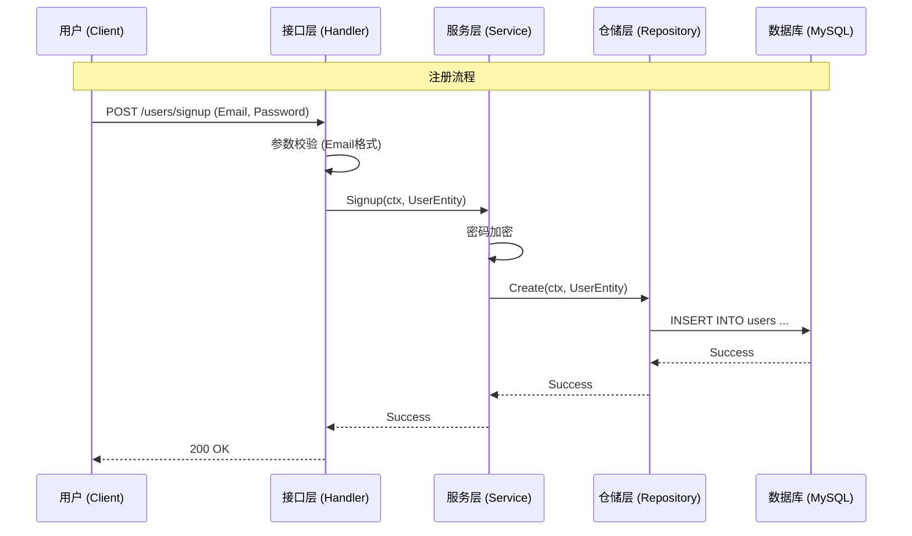

# 系统设计文档 - 用户身份认证模块

**版本**: 1.2 (采用 API First 策略)
**依赖需求**: [需求分析 - 用户身份认证](../requirements/01_user_identity_req.md)

## 1. 总体设计

本模块采用 **DDD (领域驱动设计)** 分层架构。为了减少返工，我们严格遵循 **API First (接口优先)** 的开发流程，先与前端对齐接口，再进行内部领域建模。

### 1.1 核心流程图


## 2. 详细实现步骤 (Step-by-Step Implementation)

**核心原则**: 先定契约 (API)，后定实现 (Domain/Dao)。

### 步骤 1: 定义 API 契约 (Interface Definition)
*   **动作**: 编写 Handler 层代码的**结构体定义**部分（暂时不写逻辑），明确 Request/Response 结构。
*   **Why**: **API First**。在写复杂的业务逻辑前，先和前端确认“你要传什么给我，我返回什么给你”。这能最大程度避免后端写完了，前端说“缺个字段”，导致领域层、数据库层全都要改的连锁反应。
*   **定义注册接口**:
    *   **URL**: `POST /users/signup`
    *   **Request Struct**:
        ```go
        type SignUpReq struct {
            Email           string `json:"email" binding:"required,email"`
            Password        string `json:"password" binding:"required,min=8"`
            ConfirmPassword string `json:"confirmPassword" binding:"required,eqfield=Password"`
        }
        ```
*   **定义登录接口**:
    *   **URL**: `POST /users/login`
    *   **Request Struct**:
        ```go
        type LoginReq struct {
            Email    string `json:"email" binding:"required,email"`
            Password string `json:"password" binding:"required"`
        }
        ```

### 步骤 2: 定义领域实体 (Domain Entity)
*   **动作**: 在 `internal/domain` 创建 `user.go`。
*   **代码内容**: 根据步骤 1 的接口需求，提取核心业务字段（如 `Email`, `Password`）。
*   **Why**: 接口确定后，我们就能识别出哪些是“业务核心数据”。领域层是连接“外部接口”和“底层存储”的中间桥梁。

### 步骤 3: 数据库设计与 DAO 实现
*   **动作**: 在 `internal/repository/dao` 创建 `user.go`。
*   **代码内容**: 定义 GORM 的 `User` 结构体。
    ```go
    type User struct {
        Id       int64  `gorm:"primaryKey,autoIncrement"`
        Email    string `gorm:"uniqueIndex;type:varchar(191)"`
        Password string `gorm:"type:varchar(255)"`
        Ctime    int64
        Utime    int64
    }
    ```
*   **Why**: 根据存储的特性（MySQL），设计具体的表结构。Dao 层负责把 Domain 对象变成数据库能存的 Row。

### 步骤 4: 实现 Repository 层
*   **动作**: 在 `internal/repository` 创建 `user.go`。
*   **逻辑**: 实现 Domain <-> Entity (DAO) 的转换。
*   **Why**: 隔离层。Service 层只认 Domain，不应该知道底下用的是 MySQL 还是文件系统。

### 步骤 5: 实现 Service 业务逻辑
*   **动作**: 在 `internal/service` 创建 `user.go`。
*   **逻辑**: 
    1.  接收参数。
    2.  **核心业务**: 密码加密 (`bcrypt`)。
    3.  调用 Repo 保存。
*   **Why**: 纯粹的业务逻辑所在地。

### 步骤 6: 完善 Handler 实现
*   **动作**: 填充步骤 1 中定义的 Handler 的具体逻辑。
*   **逻辑**: 调用 Service，处理错误，返回 JSON。
*   **Why**: 也就是“填坑”。步骤 1 挖好了坑，现在把逻辑填进去。

### 步骤 7: 依赖注入 (Wire)
*   **动作**: 更新 `wire.go`，把上面所有层串起来。
