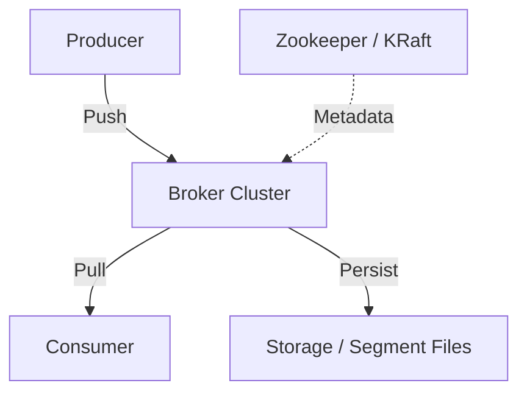

# 01. Kafka 核心概念进阶：架构与存储

## 1. 架构总览：不只是“队列”

Kafka 本质上是一个 **分布式的流平台 (Distributed Streaming Platform)**，其核心设计理念是 **Log (日志)**。

### 关键组件详解

1.  **Broker (代理/服务节点)**
    - Kafka 集群由多个 Broker 组成。
    - 每个 Broker 是一个无状态的（Stateless）进程，负责接收消息、存储消息、响应读取请求。
    - **Controller**: 集群中会有一个 Broker 被选为 Controller，负责分区 Leader 的选举和集群元数据管理。

2.  **Zookeeper / KRaft (元数据管理)**
    - **旧版 (ZooKeeper)**: 管理 Broker 列表、配置、ACL。
    - **新版 (KRaft)**: 去除 ZooKeeper 依赖，元数据存储在 Kafka 内部的一个特殊 Log 中 (Coca AI 目前使用 Zookeeper 版本)。

## 2. 深入 Partition (分区)：并发的核心

Partition 是 Kafka **并发处理** 和 **物理存储** 的最小单元。

-   **物理文件**: 假如 Topic 是 `chat.messages`，Partition 是 `0`。在磁盘上会有一个文件夹 `chat.messages-0`。
-   **Log Segment (日志分段)**: 
    - Kafka 不会将所有消息写进一个超级大文件。
    - 它是分段的：`0000000.log`, `0000000.index`, `0000000.timeindex`。
    - 默认每 1GB 或每 7 天滚动一个新的 Segment。
    - **好处**: 方便通过二分查找快速检索消息；方便定期删除过期的旧 Segment。

### 思考：为什么 Kafka 读写这么快？
1.  **顺序 I/O (Sequential I/O)**: 
    - 机械硬盘的顺序写速度（600MB/s）远快于随机写（100KB/s）。
    - Kafka 永远只在文件末尾追加 (Append Only)。
2.  **Zero-Copy (零拷贝)**:
    - 传统读取: Disk -> Kernel Buffer -> User Buffer -> Kernel Socket Buffer -> NIC。
    - Kafka (sendfile): Disk -> Kernel Buffer -> NIC。
    - 省去了 2 次 CPU 拷贝和 2 次上下文切换。

## 3. 可靠性机制 (Reliability)

### 3.1 Replica (副本)
每个 Partition 可以有多个副本。
-   **Leader**: 负责所有的读写请求。
-   **Follower**: 唯一的任务就是从 Leader 拉取消息 (Sync)，保持同步。
-   **注意**: 即使是多副本，Producer 和 Consumer **默认只跟 Leader 交互**。

### 3.2 ISR (In-Sync Replicas)
并不是所有 Follower 都有资格竞选 Leader。
-   **ISR 列表**: 只有“跟得上” Leader 的副本才在 ISR 里。
-   如果一个 Follower 卡顿超过 `10s`，它会被踢出 ISR。

### 3.3 HW (High Watermark) & LEO (Log End Offset)
-   **LEO**: 每个副本自己当前的日志末端。
-   **HW**: ISR 列表中**最小**的那个 LEO。
-   **消费者只能看见 HW 之前的消息**。这保证了即使 Leader 挂了，消费者读到的数据在新的 Leader 上一定存在，不会“回滚”。

### 3.4 ACK 机制 (Producer Settings)
生产者发送消息时，可以设置 `acks` 参数：
-   `acks=0`: 发后即忘。最快，但可能丢数据。
-   `acks=1` (默认): Leader 收到并写入磁盘就返回成功。如果 Leader 刚写完没同步就挂了，数据丢失。
-   `acks=all` (或 -1): Leader 等待 **ISR 中所有副本** 都同步成功才返回成功。最慢，最安全。
